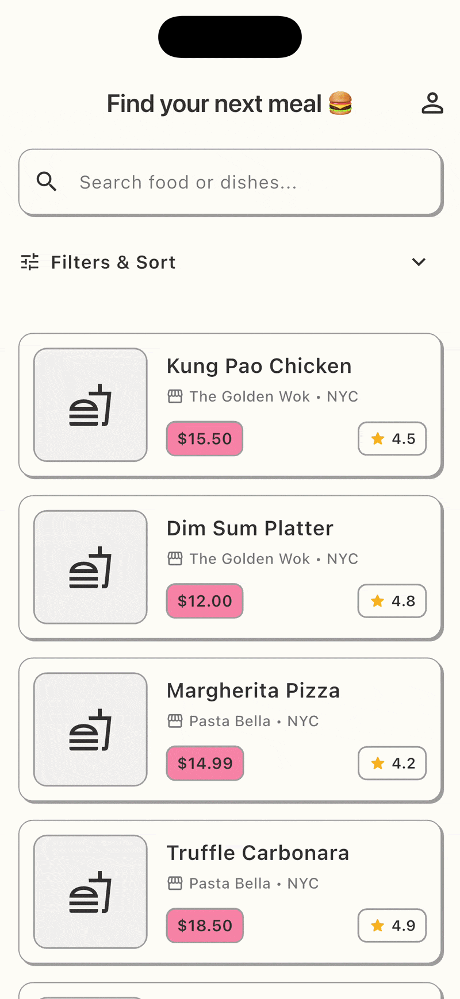
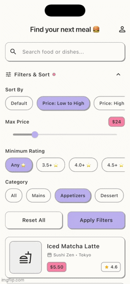

# Meal Finder - Find Your Next Meal

## Work in progress 

  
  

## Overview - Why I'm building this 
Have you ever wanted to eat out but couldn't decide what to order or where to go? You might know that a restaurant has great reviews overall, but that doesn't always mean they have the best version of the dish you're looking for. This app helps you find your next best meal based on what you want to eat and your budget, not simply the highest-rated restaurant. For example, if you're craving ramen and have a budget of $20–$30, you can compare ramen from different restaurants and find the best option for you based on ratings, price, and reviews.

## Tech Stack
- Backend: Python FastAPI
- Database: SQLite (for now, will move to PostgreSQL later)
- Frontend: Dart Flutter for mobile app

## Current State
- Home screen with list of food items with filtering and sorting feature
- Authentication, authorization with user email and password
- User's review on each food item
- User's favourite saved dish feature

## Challenges/ what I've learnt
- Design the feature to help user compare the options
- Layout of each feature and data model that is suitable for this use case. 
- I'm still learning by doing and the hard part is to implement or translate ideas to concrete results.

## What's next
- Design and implement a feature to compare food options 
- Might use AI to help you decide and you just see the data
- Not sure to have AI chat or how to have AI in which part of the app yet
- Test with more data, and where to have sample data
- Locations/map Api
- Migrate data
- Google for sign in
